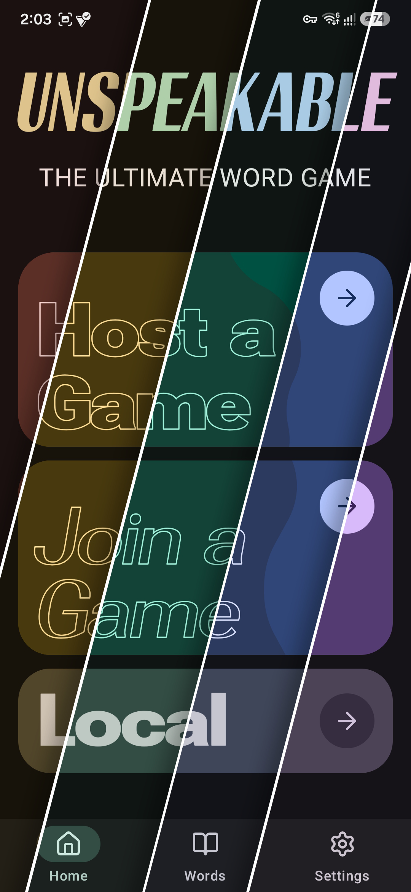
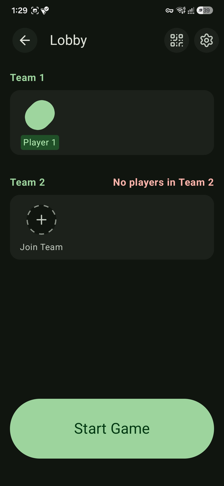
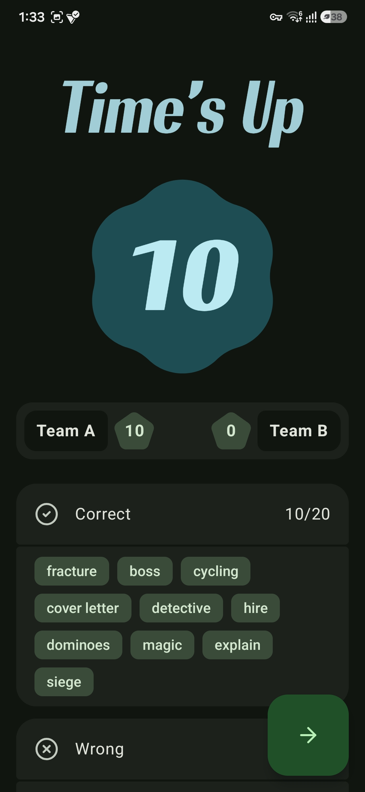
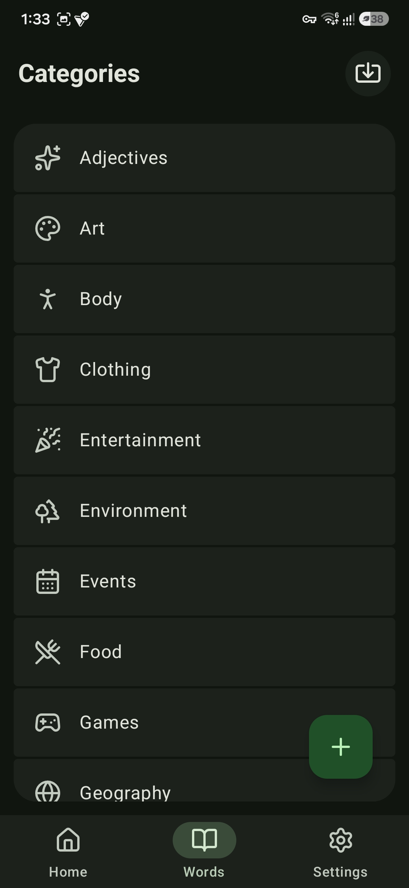
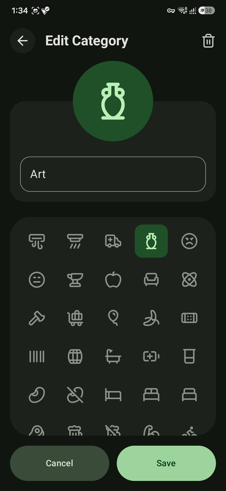

<p align="center">
  
  
</p>
<br>
<p align="center">
  
</p>

<h1 align="center" style="font-size: 56px; color: #6790a6;">
  Unspeakable
</h1>


<br>

A modernized, digital "forbidden-word" party game designed specifically for chaotic in-person play. Built for the [Hack Club Flavortown](https://flavortown.hackclub.com/) kitchen.


## About the Project

I am building this game to create party moments that physical cards just can't replicate. While you can play it normally on a single device (Pass & Play), the main twist is a **local multiplayer mode** where each team uses their own phone. 

By connecting multiple devices in the same room, the app ensures each team sees different information: The describer’s view is completely different from the opposing team’s

## Features

- **Pass & Play and local multiplayer**
    - Single‑device mode for quick games.
    - Local network games where one device acts as the host and others join as clients.

- **Multiple game modes**
    - **Classic** – guess the word without saying any of the forbidden words.
    - **Sabotage** – the other team injects new forbidden words into your cards in real time.
    - **Survival** – dynamic timer that speeds up on mistakes and slows down on correct guesses.
    - **Chain Reaction** – every correctly guessed word becomes a new forbidden word for the rest of the round.
    - **Minefield** *(planned)* – partial information for the describer, full information and a buzzer for the opposing team.

- **Configurable lobby**
    - Adjust **round time** with a slider.
    - Set **rounds per team**.
    - Toggle game modes and core rules per match.
    - Choose which **card categories** are included in the game.

- **Cards & categories editor**
    - Browse dozens of built‑in categories.
    - Create your own categories with custom icons.
    - Edit cards directly in the app: term + 5 forbidden words + assigned category.

- **Offline‑first play**
    - All cards are stored locally in an embedded database, so the game works even without internet.

## Tech Stack

This project is built completely from scratch using modern Kotlin architecture:
* **[Kotlin Multiplatform (KMP)](https://kotlinlang.org/docs/multiplatform.html):** Sharing logic, state machines, and networking across devices.
* **[Compose Multiplatform](https://www.jetbrains.com/lp/compose-multiplatform/):** A fully custom, highly expressive Material 3 UI featuring variable fonts (`Roboto Flex`).
* **[Room (SQLite)](https://developer.android.com/kotlin/multiplatform/room):** Embedded local database to store and randomly generate thousands of game cards.
* **[Ktor](https://ktor.io/):** Using Ktor's embedded server and WebSockets to allow one phone to act as the "Host" while others join the local network.

## Platforms & Compiling

The architecture is fully cross-platform! Currently, I am actively developing and testing on:
* ✅ **Android**
* ✅ **Desktop (JVM)**

*Note on iOS:* The codebase is written to support iOS natively via Kotlin Multiplatform. However, because I don't currently have a Mac, I cannot compile or test the `.ipa` build. 

## Screenshots

<p align="center">





</p>

## How to Run (Development)

Clone the repository and open it in **Android Studio** or **IntelliJ**.

**To run on Android:**
```bash
./gradlew :composeApp:installDebug
```

**To run on Desktop (JVM):**
```bash
./gradlew :composeApp:run
```

## Documentation

- `docs/README.md` - docs index.
- `docs/quickstart.md` - fast local run and first match setup.
- `docs/user_tutorial.md` - full user walkthrough.

## Credits & Acknowledgements

### AI Usage
- **[GitHub Copilot](https://github.com/features/copilot)** — code completion throughout the project.
- **[Perplexity](https://www.perplexity.ai)** — research, debugging assistance, and README formatting.
- All target words and forbidden word sets in the game were generated using Perplexity.

### Open Source Libraries

| Library | Author | License |
|---|---|---|
| [Compose Multiplatform](https://github.com/JetBrains/compose-multiplatform) | JetBrains | Apache 2.0 |
| [Kotlinx Serialization](https://github.com/Kotlin/kotlinx.serialization) | JetBrains | Apache 2.0 |
| [Kotlinx Coroutines](https://github.com/Kotlin/kotlinx.coroutines) | JetBrains | Apache 2.0 |
| [Ktor](https://github.com/ktorio/ktor) | JetBrains | Apache 2.0 |
| [Material 3](https://m3.material.io) | Google | Apache 2.0 |
| [AndroidX Room](https://developer.android.com/jetpack/androidx/releases/room) | Google | Apache 2.0 |
| [AndroidX Lifecycle](https://developer.android.com/jetpack/androidx/releases/lifecycle) | Google | Apache 2.0 |
| [Decompose](https://github.com/arkivanov/Decompose) | Arkadii Ivanov | Apache 2.0 |
| [Lucide Icons](https://lucide.dev) | Lucide Contributors | ISC |
| [compose-icons (lucide-cmp)](https://github.com/composablehorizons/compose-icons) | Composable Horizons | ISC |
| [MaterialKolor](https://github.com/jordond/materialkolor) | Jordon Boyd | MIT |
| [Lyricist](https://github.com/adrielcafe/lyricist) | Adriel Café | MIT |
| [QR Kit](https://github.com/ChainTechNetwork/QRKitComposeMultiplatform) | ChainTech Network | MIT |
| [colormath](https://github.com/ajalt/colormath) | AJ Alt | MIT |
| [Multiplatform Settings](https://github.com/russhwolf/multiplatform-settings) | Russell Wolf | Apache 2.0 |
| [Kermit](https://github.com/touchlab/Kermit) | Touchlab | Apache 2.0 |
| [SQLDelight](https://github.com/cashapp/sqldelight) | Cash App | Apache 2.0 |